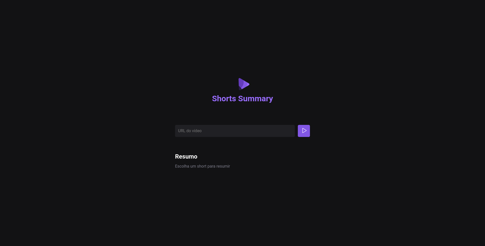

  Projeto realizado dentro do NLW IA. 

  <a href="#-tecnologias">Tecnologias</a>&nbsp;&nbsp;&nbsp;|&nbsp;&nbsp;&nbsp;
  <a href="#memo-licença">Licença</a>

  

 

  

## 🚀 Tecnologias

Esse projeto foi desenvolvido com as seguintes tecnologias:

- HTML, CSS e JavaScript
- Git e Github
- Figma
- Node.js
- Inteligência Artificial

## 💻 Projeto

Projeto realizado dentro do NLW-IA Foundations da Rocketseat. Neste projeto desenvolvemos uma aplicação que utiliza inteligência artificial para capturar o áudio dos vídeos shorts do YouTube e gerar um resumo em texto do que foi falado no short.

## :memo: Licença

Esse projeto está sob a licença MIT.

---

Feito com ♥ by Rocketseat :wave: [Participe da nossa comunidade!](https://discord.gg/rocketseat)